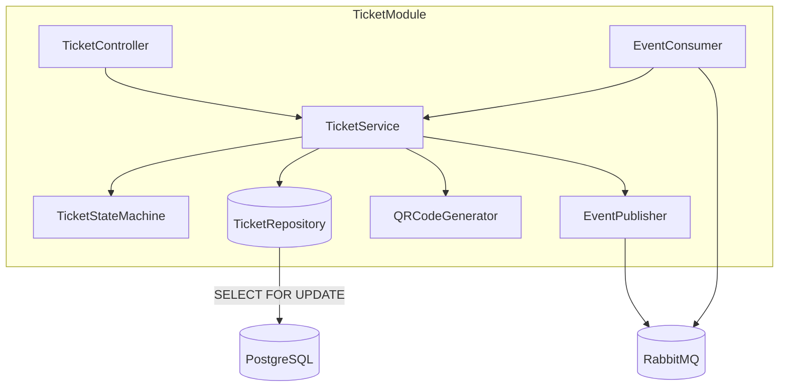
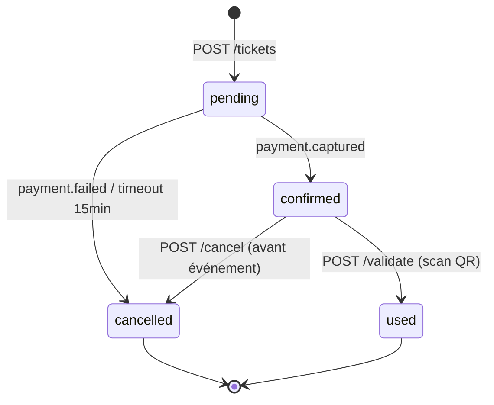
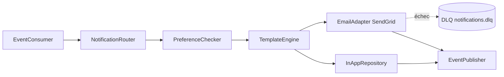
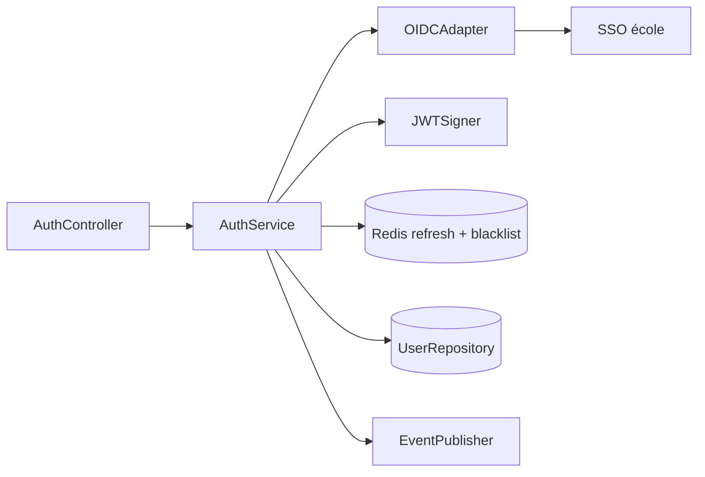
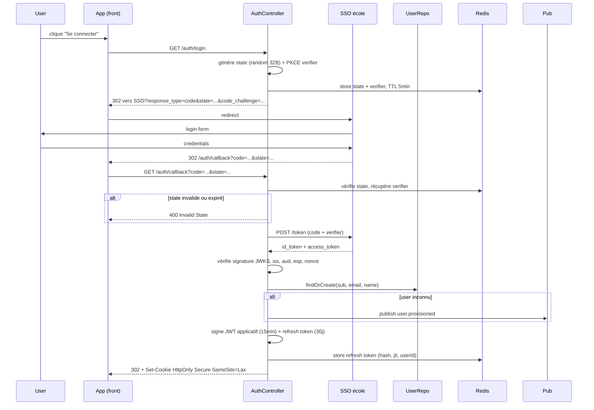

# §7 — Conception détaillée par module

**Projet** : SupEvents
**Auteurs** : Samy Abdelmalek, Tristan Sanjuan, Saam
**Date** : 2026-04-29
**Modules retenus** : `TicketModule` (métier complexe), `NotificationModule` (orchestration asynchrone), `AuthModule` (transverse)

---

## §7.1 — TicketModule

### Responsabilité
Gérer le cycle de vie d'un billet pour un événement donné : allocation atomique d'une place sur jauge limitée, transitions d'états, génération du QR code de validation.

### Contrat d'interface

**Endpoints REST exposés**

| Méthode | Chemin | Codes retour |
|---|---|---|
| `POST` | `/api/events/{eventId}/tickets` | `201`, `400`, `401`, `403`, `409` (sold out), `422` (idempotence rejouée) |
| `GET` | `/api/tickets/{ticketId}` | `200`, `401`, `403`, `404` |
| `GET` | `/api/tickets/{ticketId}/qr` | `200` (image/png), `401`, `403`, `404`, `410` (annulé) |
| `POST` | `/api/tickets/{ticketId}/cancel` | `204`, `401`, `403`, `404`, `409` (déjà used) |
| `POST` | `/api/tickets/{ticketId}/validate` | `200`, `401`, `403`, `404`, `409` (déjà used / annulé) |

**Événements publiés (RabbitMQ)**

- `ticket.reserved` — topic `tickets.events`, déclenche le `PaymentIntent` côté `PaymentModule`
- `ticket.confirmed` — topic `tickets.events`, déclenche envoi mail + QR par `NotificationModule`
- `ticket.cancelled` — topic `tickets.events`, libère la jauge et déclenche remboursement Stripe
- `ticket.used` — topic `tickets.events`, alimente l'historique de présence

**Événements consommés (RabbitMQ)**

- `payment.captured` (topic `payments.events`) → transition `pending → confirmed`
- `payment.failed` (topic `payments.events`) → transition `pending → cancelled` et libération de la jauge
- `event.cancelled` (topic `events.events`) → annulation en masse de tous les billets liés

**Appels sortants**

- Aucun appel direct vers un système tiers — découplage assuré par le bus de messages. La génération du QR code est locale (signature HMAC, voir ADR-003).

### Architecture interne



Le `TicketService` orchestre la transaction d'allocation. Le `TicketStateMachine` est une classe pure qui encode les transitions autorisées et refuse les transitions illégales avec une erreur typée.

#### Cycle de vie du ticket



### Algorithme critique : allocation concurrente sur dernière place

Verrou pessimiste `SELECT FOR UPDATE` sur la ligne `event` (voir ADR-001). Deux requêtes simultanées sur la dernière place sont sérialisées par PostgreSQL ; la perdante reçoit `409 Sold Out`.

```
fonction reserveTicket(userId, eventId, idempotencyKey):
  # 1. Idempotence : si la clé existe déjà, retourner le ticket précédent
  existing = ticketRepo.findByIdempotencyKey(idempotencyKey)
  si existing existe:
    retourner existing  # 422 si l'utilisateur diffère

  BEGIN TRANSACTION (isolation = READ COMMITTED)
    # 2. Verrou pessimiste sur la jauge
    event = eventRepo.lockForUpdate(eventId)  # SELECT ... FOR UPDATE
    si event.status != 'published':
      ROLLBACK; lever EventNotPublished (409)
    si event.seatsReserved >= event.capacity:
      ROLLBACK; lever SoldOut (409)

    # 3. Création du ticket
    ticket = Ticket(userId, eventId, status='pending', idempotencyKey, expiresAt=now+15min)
    ticketRepo.insert(ticket)
    eventRepo.incrementSeatsReserved(eventId)

  COMMIT

  # 4. Publication de l'événement (outbox pattern dans la même transaction)
  publisher.publish('ticket.reserved', { ticketId, userId, eventId, amount })
  retourner ticket
```

**Décisions documentées** : verrou pessimiste plutôt qu'optimiste (cf. ADR-001) — la contention sur la dernière place est forte et brève, le coût d'un retry massif côté client est jugé pire que le coût d'un lock court côté DB. L'expiration à 15 min libère automatiquement les places non payées.

### Gestion des erreurs

| Code interne | Cause | Comportement | Code HTTP |
|---|---|---|---|
| `TICKET_SOLD_OUT` | Jauge atteinte au moment du verrou | Refus, message clair, libération immédiate du verrou | `409` |
| `TICKET_EVENT_CLOSED` | Événement annulé / archivé / brouillon | Refus, message expliquant l'état | `409` |
| `TICKET_IDEMPOTENCY_CONFLICT` | Clé d'idempotence rejouée avec un payload différent | Refus, log de l'incohérence | `422` |
| `TICKET_PAYMENT_TIMEOUT` | Aucun `payment.captured` reçu sous 15 min | Tâche planifiée → `pending → cancelled`, libération | `—` (interne) |
| `TICKET_DB_UNAVAILABLE` | PostgreSQL injoignable / lock timeout > 5s | Retry côté client autorisé, alerte oncall | `503` |

### Cas limites

**Cas limite 1 — Double-clic sur "S'inscrire"**
Description : l'utilisateur clique deux fois en moins d'une seconde, deux requêtes parallèles arrivent avec le même `Idempotency-Key`.
Décision retenue : la clé `Idempotency-Key` (UUID v4 généré côté client) est obligatoire sur `POST /tickets`. Le `TicketRepository` impose une contrainte unique `(idempotency_key, user_id)`. La seconde requête retourne le ticket existant (`200`) plutôt que d'en créer un second.

**Cas limite 2 — Annulation après paiement capturé**
Description : l'utilisateur annule son ticket alors que le paiement Stripe a déjà été capturé.
Décision retenue : transition `confirmed → cancelled` autorisée jusqu'à 24h avant l'événement. Publication de `ticket.cancelled` qui déclenche un `refund` Stripe asynchrone via `PaymentModule`. Au-delà de 24h, refus `409` avec message explicite (politique de remboursement de l'événement).

### Décisions structurantes
- Voir **ADR-001** — Stratégie de gestion de la concurrence sur la dernière place

---

## §7.2 — NotificationModule

### Responsabilité
Délivrer les notifications transactionnelles (email via SendGrid, in-app) de manière asynchrone, fiable et respectueuse des préférences utilisateur.

### Contrat d'interface

**Endpoints REST exposés**

| Méthode | Chemin | Codes retour |
|---|---|---|
| `GET` | `/api/users/me/notifications` | `200`, `401` |
| `PATCH` | `/api/users/me/notifications/{id}/read` | `204`, `401`, `404` |
| `GET` | `/api/users/me/notification-preferences` | `200`, `401` |
| `PUT` | `/api/users/me/notification-preferences` | `200`, `400`, `401` |

**Événements publiés (RabbitMQ)**

- `notification.delivered` — topic `notifications.events`, métriques d'engagement
- `notification.failed.permanent` — topic `notifications.events`, après épuisement des retries

**Événements consommés (RabbitMQ)**

- `ticket.confirmed` (topic `tickets.events`) → mail de confirmation + QR code attaché
- `ticket.cancelled` (topic `tickets.events`) → mail d'annulation + remboursement
- `event.cancelled` (topic `events.events`) → mail à tous les détenteurs de billets confirmés
- `event.published` (topic `events.events`) → notification in-app aux abonnés

**Appels sortants**

- **SendGrid** — HTTPS REST `POST /v3/mail/send`, finalité : envoi des emails transactionnels
- **PostgreSQL** — stockage des notifications in-app et préférences utilisateur

### Architecture interne



### Algorithme critique : retry + bascule DLQ sur échec SendGrid

```
fonction handleEvent(event):
  user = userRepo.findById(event.userId)
  prefs = preferenceRepo.findByUser(user.id)
  si not prefs.allows(event.type):
    log "skip: user opted out"; ack(); retourner

  template = templateEngine.render(event.type, user.locale, event.payload)

  pour chaque canal dans prefs.channels:
    essayer:
      adapter[canal].send(user, template)
      publish('notification.delivered', { userId, type, canal })
    sauf TransientError as e:
      # erreur 5xx, timeout, rate-limit SendGrid 429
      si event.retryCount < 5:
        # backoff exponentiel : 30s, 2min, 8min, 30min, 2h
        republish(event, delay = 30s * 4^retryCount, retryCount+1)
      sinon:
        deadLetterQueue.send(event, raison=e)
        publish('notification.failed.permanent', { userId, type, raison })
    sauf PermanentError as e:
      # 4xx hors 429 : email invalide, blacklisté
      log; deadLetterQueue.send(event, raison=e)
      publish('notification.failed.permanent', { ... })
```

**Décisions documentées** : 5 tentatives avec backoff exponentiel `30s × 4^n` (≈ 2h40 cumulé), au-delà DLQ pour intervention manuelle (cf. ADR-002). Les erreurs 4xx (hors 429) ne sont jamais retentées — un email invalide ne deviendra pas valide par magie.

### Gestion des erreurs

| Code interne | Cause | Comportement | Code HTTP |
|---|---|---|---|
| `NOTIF_USER_OPTED_OUT` | Préférence utilisateur désactivée pour ce type | Skip silencieux, log info | `—` |
| `NOTIF_INVALID_EMAIL` | SendGrid renvoie 400 (email mal formé) | Pas de retry, DLQ, marquer email comme invalide côté User | `—` |
| `NOTIF_SENDGRID_5XX` | SendGrid temporairement indisponible | Retry avec backoff exponentiel (max 5) puis DLQ | `502` (côté API si appelée) |
| `NOTIF_RATE_LIMIT` | SendGrid 429 | Retry honorant le `Retry-After` retourné | `—` |
| `NOTIF_PREFS_INVALID` | PUT préférences avec canal inconnu | Refus, message d'erreur | `400` |

### Cas limites

**Cas limite 1 — SendGrid indisponible pendant plusieurs heures**
Description : SendGrid renvoie des 503 sur l'ensemble des envois pendant 4h.
Décision retenue : les messages restent dans la file de retry avec backoff exponentiel jusqu'à épuisement (5 tentatives ≈ 2h40), puis basculent en DLQ. Une alerte oncall se déclenche dès que le taux de remplissage de la DLQ dépasse 1% du débit nominal sur 5 min. Le rejeu manuel depuis la DLQ est documenté dans le runbook.

**Cas limite 2 — Utilisateur sans email valide**
Description : utilisateur provisionné via SSO école avec un email obsolète, SendGrid retourne 400 « invalid recipient ».
Décision retenue : le canal `email` est marqué `invalid` sur le profil utilisateur (champ `email_status`), aucune nouvelle tentative d'envoi email n'est faite tant que l'utilisateur n'a pas mis à jour son email. La notification in-app est conservée en fallback. Un événement `user.email.invalidated` est publié pour permettre une éventuelle relance UX.

### Décisions structurantes
- Voir **ADR-002** — Politique de retry et DLQ des événements asynchrones

---

## §7.3 — AuthModule

### Responsabilité
Authentifier les utilisateurs via le SSO école (OIDC), émettre et valider les jetons JWT applicatifs, et propager le contexte d'authentification (identité + rôles) aux autres modules.

### Contrat d'interface

**Endpoints REST exposés**

| Méthode | Chemin | Codes retour |
|---|---|---|
| `GET` | `/api/auth/login` | `302` (redirect SSO) |
| `GET` | `/api/auth/callback` | `302` (redirect app), `400` (state invalide), `401` (code invalide) |
| `POST` | `/api/auth/refresh` | `200`, `401` (refresh expiré ou révoqué) |
| `POST` | `/api/auth/logout` | `204`, `401` |
| `GET` | `/api/auth/me` | `200`, `401` |

**Événements publiés (RabbitMQ)**

- `user.provisioned` — topic `auth.events`, premier login d'un utilisateur inconnu (déclenche création profil côté `UserModule`)
- `user.role.changed` — topic `auth.events`, changement de rôle (étudiant → organisateur)
- `user.session.revoked` — topic `auth.events`, déconnexion explicite ou révocation admin

**Événements consommés (RabbitMQ)**

- `user.deleted` (topic `users.events`) → révocation immédiate de tous les refresh tokens

**Appels sortants**

- **SSO école (OIDC)** — HTTPS, endpoints `/authorize`, `/token`, `/userinfo` ; finalité : authentification fédérée
- **Redis** — stockage des refresh tokens et de la liste de révocation JWT (jti blacklist)

### Architecture interne



### Algorithme critique : flow OIDC Authorization Code + provisioning



**Décisions documentées** :
- JWT applicatif court (15 min) + refresh token long (30j) stocké en Redis (révocable). Voir ADR-003.
- Cookies `HttpOnly`, `Secure`, `SameSite=Lax` — pas de stockage en localStorage.
- `state` + PKCE obligatoires pour empêcher CSRF + interception du code.
- Provisioning automatique au premier login (pas de pré-création manuelle).

### Gestion des erreurs

| Code interne | Cause | Comportement | Code HTTP |
|---|---|---|---|
| `AUTH_STATE_INVALID` | `state` absent / expiré / déjà consommé | Refus, log de tentative CSRF potentielle | `400` |
| `AUTH_TOKEN_EXPIRED` | JWT expiré | Le client doit appeler `/refresh` | `401` |
| `AUTH_REFRESH_REVOKED` | Refresh token blacklisté ou inconnu | Force re-login complet | `401` |
| `AUTH_SSO_UNAVAILABLE` | SSO école injoignable au callback | Page d'erreur, retry suggéré, métrique d'incident | `503` |
| `AUTH_FORBIDDEN_ROLE` | Rôle insuffisant pour l'action | Refus, log audit | `403` |

### Cas limites

**Cas limite 1 — JWT révoqué côté SSO mais encore valide localement**
Description : un compte étudiant est désactivé côté SSO école (départ de l'établissement) mais le JWT applicatif émis 10 min plus tôt n'expire que dans 5 min.
Décision retenue : durée de vie courte du JWT (15 min) qui borne la fenêtre d'exposition. Le refresh sera refusé par le SSO au prochain appel `/refresh`, déconnectant l'utilisateur sous 15 min maximum. Une révocation immédiate est possible via l'événement `user.session.revoked` qui ajoute le `jti` à la blacklist Redis (TTL = durée de vie restante du JWT).

**Cas limite 2 — Premier login d'un utilisateur inconnu**
Description : un étudiant authentifié par le SSO école n'existe pas encore dans la base SupEvents.
Décision retenue : provisioning automatique au callback OIDC. Le `sub` OIDC (identifiant école stable) est utilisé comme clé externe ; les attributs `email`, `name`, `affiliation` sont extraits du `userinfo` endpoint. Rôle initial : `student`. Publication de `user.provisioned` pour permettre aux autres modules de réagir (création préférences notif par défaut, etc.).

### Décisions structurantes
- Voir **ADR-003** — Stratégie d'authentification applicative (JWT stateless court + refresh stateful)

---

## Cohérence avec le TP 1.4

Vérifié avant clôture :
- [x] Toutes les entités manipulées (`Ticket`, `Event`, `User`, `NotificationPreference`, `RefreshToken`) figurent au dictionnaire de données §6.4
- [x] Tous les endpoints listés ci-dessus apparaissent dans le tableau synoptique §8
- [x] Tous les événements (`ticket.*`, `notification.*`, `user.*`) sont décrits §8 avec leur schéma JSON
- [x] Codes HTTP cohérents entre §7 et §8
